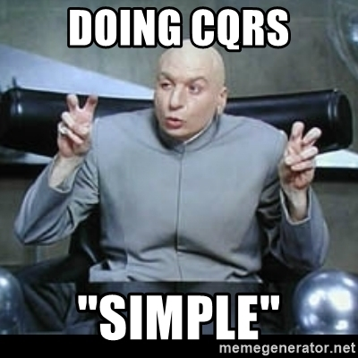

<!-- PROJECT LOGO -->
 

    
  </a>

<h3 align="center">OrderManagement-With-CQRS</h3>

  

    This project developed on Mac OS - Visual Studio 2022 PRE version. I want to contribute Microsoft Team that's why I developed on new PRE version of VS. But in my opinion Windows is still best for developing .Net .. 😁
     
    <a href="https://github.com/furkandadali/OrderManagement-With-CQRS"><strong>Explore the docs »</strong></a>
     
     
    <a href="https://github.com/furkandadali/OrderManagement-With-CQRS">View Demo</a>
    ·
    <a href="https://github.com/furkandadali/OrderManagement-With-CQRS/issues">Report Bug</a>
    ·
    <a href="https://github.com/furkandadali/OrderManagement-With-CQRS/issues">Request Feature</a>
  

<!-- ABOUT THE PROJECT -->
## About The Project

<table>
    <tr>
        <td class="height" style="text-align: center; vertical-align: middle;">
            
        </td>
    </tr>
</table>

Let me share a scenario with you before diving tropical part. I believe that when you imagine the issue in your mind, understand to complex things getting more easier. If your coffee is ready lets start.☕️

STORY

Please think that you are going to one of the most popular coffee shop in world. And It is rush hour. Everybody has limited time and place getting crowded. But we have a problem there is only one point to order and take away your order from. What? 😱 Of course cashier working asynchronous.  Keep going to take order and when order get ready give to customer. Could you imagine that complexity. But actually how it works in real life? It is different points to make order and take your coffee when its ready. I think we start to fill some gaps. Let’s see how it is process for CQRS.

What is CQRS?

CQRS is stands for Command Query Responsibility Segregation. First explanation about CQRS be thought from Greg young. And Also Command Query Responsibility Segregation (CQRS) architectures expand the concept of command query division at the architectural level. But these architectures are not architectures of the whole software system. It is a design of just one part of the software and that part is called the Application Layer. Why it makes CQRS a design pattern. By they means, CQRS include important benefits for our system which flexibility, scalable, performance measuring, able to security improvements.

<table>
    <tr>
        <td class="height" style="text-align: center; vertical-align: middle;">
            
        </td>
    </tr>
</table>

### Built With

* [C#](https://docs.microsoft.com/tr-tr/dotnet/csharp/)
* [.Net Core](https://docs.microsoft.com/tr-tr/dotnet/welcome)

